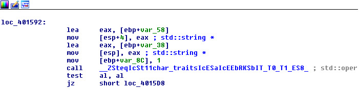
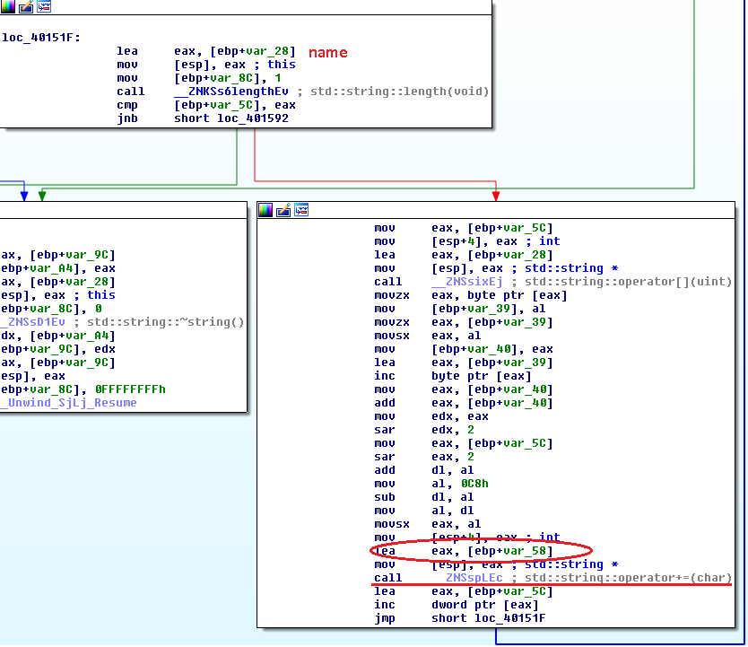
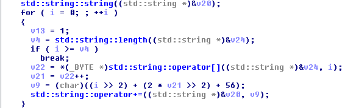
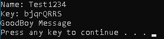

## crackmes.de's keygenme1 by rayko
source: https://crackmes.one/crackme/5ab77f6633c5d40ad448cc49


# Challenge

An exe file in asks for `name` and `serial`

# Solution

I opened the exe with IDA and looked for the strings, The most interesting is the `BadBoy Message` we get from the program.



__loc_401592__ decide if its good serial or not. `[ebp+var38]` is used for the __serial__ and `[ebp+var28]` for name not `[ebp+var58]` as cpmpared here.\
By reading the code for the `Wrong\Correct` massage I found this:



__loc_40151F__ generate some value from the name (`[ebp+var38]`) and stored to `[ebp+var58]`.\
By generating Pseudocode with IDA this is the main calculations:



I made a keygen written in python [keygen.py](keygen.py)

```
python keygen.py
Name:Test1234
bjqrQRRS
```


