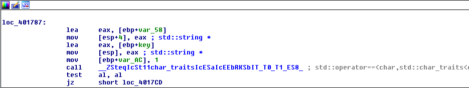
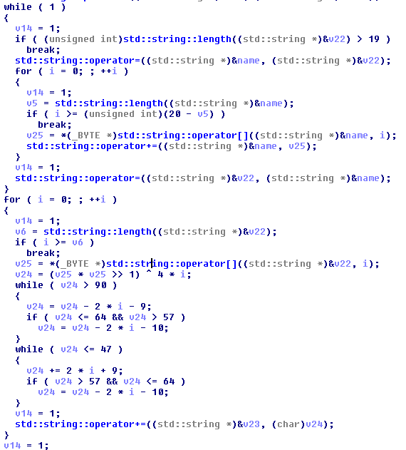
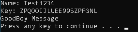

## crackmes.de's keygenme2 by rayko
source: https://crackmes.one/crackme/5ab77f6633c5d40ad448cc4a


# Challenge

An exe file in asks for `name` and `serial`

# Solution

I opened the exe with IDA and looked for the strings, The most interesting is the `BadBoy Message` we get from the program.



__loc_401787__ decide if its good serial or not. `[ebp+vkey]` is used for the __serial__ and `[ebp+name]` for name not `[ebp+var58]` as cpmpared here.\
By reading the code for the `Wrong\Correct` massage I found this pretty scrambled calculation I used IDA to generate pseudocode\
for better understanding the algorithm



I made a keygen written in python [keygen.py](keygen.py)

```
python keygen.py
Name:Test1234
ZPQOOIJLUEE99SZPFGNL
```


