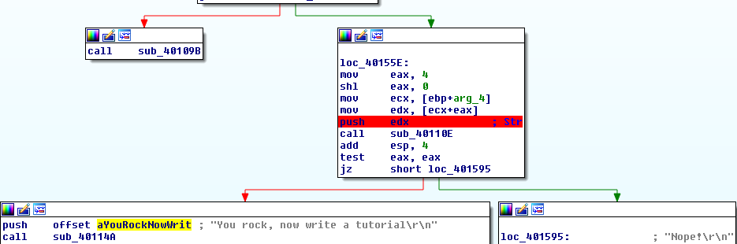
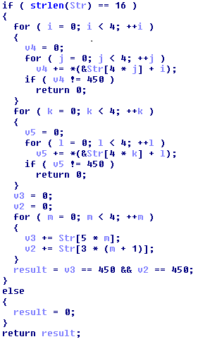

## nextco's Crackme 3 by @rextco
source: https://crackmes.one/crackme/5b7dd53233c5d441d87ccbef


# Challenge

An exe file in waiting for a password

# Solution

I opened the exe with IDA and looked for the strings, The most interesting one is __" You rock, now write a tutorial"__\
I cross-reference it and got here:


__sub_40110E__ seems to decide if our str is good or bad. __sub_40110E__ leads to __sub_401400__.\
__sub_401400__ has a lot of loops and its assembly code seems very complicated. IDA pseudocode simplifies everything.



The code seems simple now:
* __str len=16__
* __password[0] + password[4] + password[8] + password[12]=450__
* __password[1] + password[5] + password[9] + password[13]=450__
* __password[2] + password[6] + password[10] + password[14]=450__
* __password[3] + password[7] + password[11] + password[15]=450__
* __password[0] + password[1] + password[2] + password[3]=450__
* __password[4] + password[5] + password[6] + password[7]=450__
* __password[8] + password[9] + password[10] + password[11]=450__
* __password[12] + password[13] + password[14] + password[15=450__
* __password[0] + password[5] + password[10] + password[15]=450__
* __password[3] + password[6] + password[9] + password[12]=450__

We have 10 equations with 16 variables. By usining liniar algebra we can find the solutions for this equations. Its can be simpley done by matrixcalc.org.
* __x_13=450-x_14-x_15-x_16__
* __x_9=450-x_10-x_11-x_12__
* __x_7=-450+x_8-x_10+x_12+x_14+x_15+2*x_16__
* __x_6=900-x_8-x_11-x_12-x_14-x_15-2*x_16__
* __x_5=-x_8+x_10+x_11__
* __x_4=450-x_8-x_12-x_16__
* __x_3=900-x_8+x_10-x_11-x_12-x_14-2*x_15-2*x_16__
* __x_2=-450+x_8-x_10+x_11+x_12+x_15+2*x_16__
* __x_1=-450+x_8+x_12+x_14+x_15+x_16__
* where __x_8, x_10, x_11, x_12, x_14, x_15, x_16__ are independent variable
When x_i i represent i-th position.

I made python scrip for finding valid password see:  [solution.py](solution.py)

```cmd
python solution.py
luqpitqtvjsowomo
```

