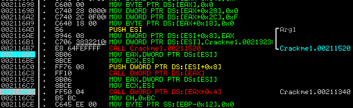
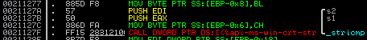
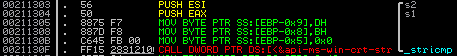

## P45H3's Biiiiit
source: https://crackmes.one/crackme/5cb5dfa233c5d4419da55824

# Challenge

An exe that ask for what seems to be username and password (a lot of `????`)

# Solution

I opened the exe with IDA and looked for useful strings but without a success.\
I went to ollyDbg. I tried to trace the function that prints the characters and gets the input.\
After few tries and brake points, __sub_2121B3__(Start) -> __sub_212126__.

At __0x2116B7__ the program calls to __sub_211520__ which prints the question marks and gets the input.\
__call [eax]__ does something and then __call [eax+4]__ prints the error message.

Its seems like __call [eax]__ makes the check if the name and passwords are valid.\
At __call [eax]__ which is __sub_211220__ it calls twice to **_stricmp**.\

I put a breakpoint on **_stricmp**, the expected string are:__Source__ and __Engine2013__
