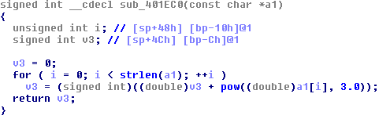
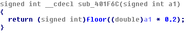
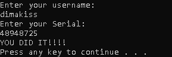

## l2l3's Crack or Keyme #1
source: https://crackmes.one/crackme/5cbac94633c5d4419da55881

# Challenge

An exe file in waiting for a username and password

# Solution

I opened the exe with IDA and went for the strings.\
I cross-referenced the first `Enter username` string, and I got to __sub_4014D2__ which look like the main function.\
There is a manual load of `msvcrt_printf` and `msvcrt_scanf` it's simply can be tracked from the __call eax__.\

The name saved in __unk_405040__ and the password at __[ebp+var_30]__.\
Then the username passed to __sub_401EC0__ which cubes every character and sums it up, and the password passed to __sub_401F6C__ which multiplies it by 0.2 and flor it.\
later the 2 numbers compered.

The __sub_401EC0__ pseudocode:


The __sub_401F6C__ pseudocode:


I made a python scrip for password generator:
```python
username= "dimakiss"
temp=0
for i in username:
    temp+=ord(i)**3
print("Password range: ",int(temp/0.2),"-",int((temp+1)/0.2-1))
```
__Output: __
```
Password range:  48948725 - 48948729
```

So the solution is __48948725__


