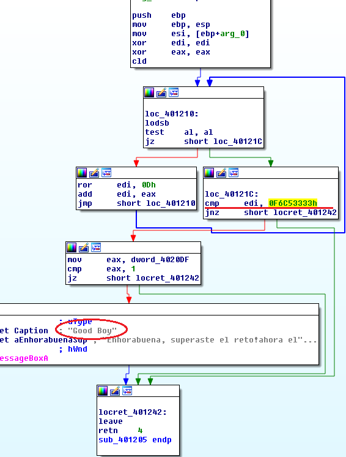
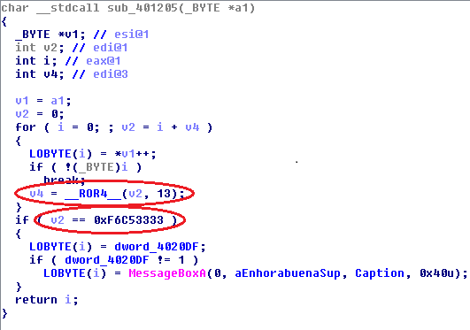

## LordShy's fary Crackme v1.0
source: https://crackmes.one/crackme/5e808bdd33c5d4439bb2dff8

# Challenge

A program what asks for `Fary Password: `

# Solution

I opened the exe with IDA and looked for strings, __Good boy__ looks like the output string of the correct Password

By cross-referencing I got here, it seems like check routine if correct pricing. if don't print.
I generated IDA's pseudocode for simplicity.

The code takes every character, adds it to v2 and rotate right 13 bits.\
If the end results equal to 4140118835 (0xF6C53333h) print `Good boy`.

I made a python script that generates random keys for this purpose see [solution.py](solution.py)\
There are alot of different flags possible one of them is : __nJjQySs~__
