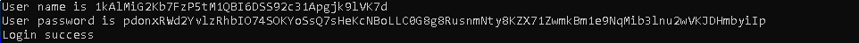

## StyLE's CrackME
source: https://crackmes.one/crackme/5e82f7c733c5d4439bb2e037

# Challenge

An exe file in wating for user name and password \
The desctription of the challange is\
``` 
lvl1 - patch all checks
lvl2 - patch only srand and find name with password
lvl3 - find name and password without patching
```


# Solution

I opened the exe with IDA and looked for thes string __User name is__ the only corss reference is to ` sub_401330 `\
There is a usage of `rand` and `time64` , at `0x4013C8` the funtion `sub_401A30` decide if the `al` register is __0__\
if it is don't jump to `loc_4014BF` which is bad boy.


`Note: the test al,al and the jz jump can be noped to avoid this check`


At `0x401437` `"Login success"` is moved to `EDX` and at `0x40143C` the same simillar check takes place,\
if al=0 don't jump to `0xloc_40144A` \
but if al!=0 we will skip the command `mov edx, offset aInvalidPasswor` and `EDX` will remain `"Login success"`


`Note: we will always jump over this update of EDX`

# Lvl 1- Noping

```asm
002E13CD TEST AL,AL        
002E13CF JE simple_c.002E14BF
```
To
```asm
002E13CD NOP
002E13CE NOP
002E13CF NOP
002E13D0 NOP
002E13D1 NOP
002E13D2 NOP
002E13D3 NOP
002E13D4 NOP
```

And
```asm
002E1441 test al,al
```
To
```asm
002E1441 JMP SHORT simple_c.002E144A
```
Run perfect\


# Lvl 2- Noping only the random 

`srand` location is `0x2E1361` and the push `EAX` should be noped
```asm                                                 
002E1361 CALL DWORD PTR DS:[<&api-ms-win-crt-utility-l1-1-0.srand>] 
```
To
```asm
002E1361 NOP 
002E1362 NOP
002E1363 NOP
002E1364 NOP
002E1365 NOP
002E1366 NOP
```

The funtion that called in `0x2E1382` `sub_2E1240` which get pointer to `[EBP-0x70]` by the this pointer (`ECX`)and put the string\
__`1kAlMiG2Kb7FzP5tM1QBI6DSS92c31Apgjk9lVK7d`__ which later comared to the user name.

The `rand` at `0x2E13D5` always update `EAX` to the smae number so i decided that what the crackme autor meant..\
The funtion that called in `0x2E13ED` the same `sub_2E1240` which get pointer to `[EBP-0x58]` by the this pointer (`ECX`)and put the string\
__`pdonxRWd2YvlzRhbIO74SOKYoSsQ7sHeKcNBoLLC0G8g8RusnmNty8KZX71ZwmkBm1e9NqMib3lnu2wVKJDHmbyiIp`__ which later comared to the user password.



`Note:with the "srand" the password and the name was random so lvl3 lost its point`


