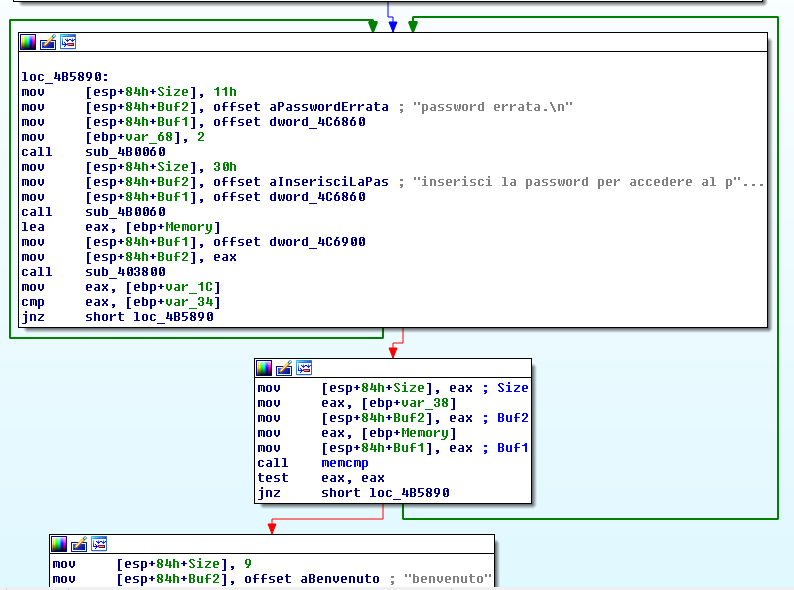
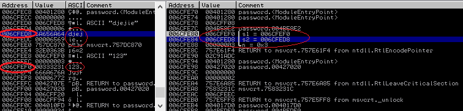
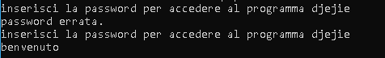

## TheReverser's Find password
source: https://crackmes.one/crackme/5e9f4e8033c5d476117463a9

# Challenge

A `password.exe` file in which written when open `inserisci la password per accedere al programma`\
only guess that its wait for a password.
The description also offers us to try and bypass the password check.

# Solution
After entering random password its print `password errata.` and `inserisci la password per accedere al programma` again.\
By uploading the file to IDA the `password errata.` is seen in the `Strings window`, the strings' location is `0x4B9091`.\
By cross-referencing this string we can see that the only access to this string is in `sub_4B57D0+C8` or `0x04B5898`.\
There is a loop between `0x04B58E8` and `0x04B5902` to `0x04B5890`,\
when `0x04B58FB` has a __memcmp__ call. 

`Note: if we scroll up we will have the strings  djejie and ggkfjgjfrg  , which seem suspicious but we continue`


The program will not break at the first time we input password, seems there is pre routine to this code\
it does not seem to be important.

At the second input it will only brake at the conditional jump before it at `0x4B58E8`.\
By setting the zero flag on we will by pass that conditional jump and brake on __memcmp__.\
The __memcmp__ gets 2 values , `s1=006CFEF0  s2=006CFED8`\


`123` our input compared with `djejie`(as I thought) if they are equal\
`EAX` will be equal `0` and the jump at `0x4B5902` will not happen, the loop will end the message `benvenuto` will be printed.\
As I told for the first time the password is not correct but the second time it works fine.\


In our solution, we avoided the 2 conditional jumps at `0x04B58E8` and `0x04B5902`\
by noping them we spouse to always be right.

```asm
004B58E8 JNZ SHORT password.004B5890 
to
004B58E8 nop

and 
004B5902 JNZ SHORT password.004B5890
to 
004B5902 nop
```

