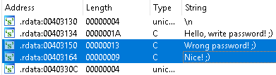
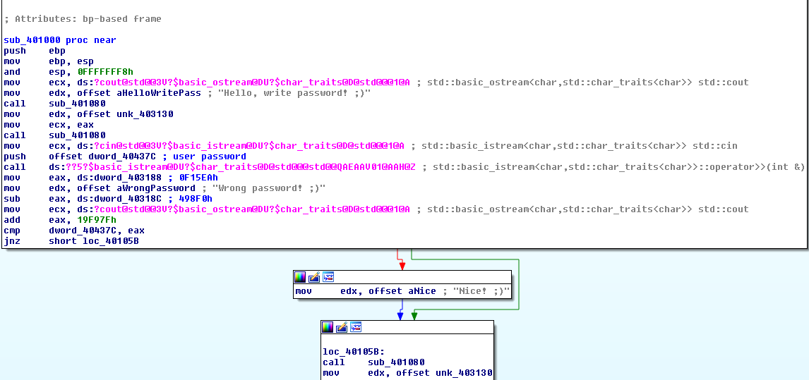
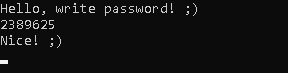

## TheReverser's Find password
source: https://crackmes.one/crackme/5ec0207b33c5d449d91ae508

# Challenge

An exe that wait for our input password.

# Solution

I opened IDA PRO there are interesting strings in the strings subview.
`"Nice! ;)"` and `"Wrong password! ;)"` the most interesting the Good/Bad desition.

There is only one cross reference to this string at the funtion `sub_401000`.

after the `"Hello,write.."` and after the other sting, the function `sub_401080` we can assume that its print to console function.\
The call to the long function is acsually `cin` in c++ which used to accept input.\
Its can be assumed that the pushed offset __dword_40437C__ stores the users password input we renamed it `user password`.\
Later `dword_40437C` compered with `eax` and if its equal the code will jump to `0x0401056` and updater the `edx` to `Nice! ;)`\
`edx` was `Wrong password! ;)` (`0x401038`).

__0F15EAh__ is moved to `eax`, then __498F0h__ is subtracted from `eax` and __19F97Fh__ is added.\
so __`eax`=0F15EA-498F0+19F97F=247679h (2389625)__

If our password is equal to __2389625__  "Nice! ;)" should be printed.

