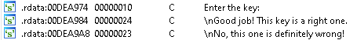

## SD4RK's KeyMe
source: https://crackmes.one/crackme/5cbac94633c5d4419da55881

# Challenge

An exe file in waiting for a username and password

# Solution

I opened the exe with IDA and went for the strings.\


These 3 strings all relate to __sub_DC2070__. 

At __0xDC20D8__ there is the first check if the length of the input is __16(10h)__.\
Then the first 5 characters calculated with `AND 224(0E0h)` and compared to `32(20h)` print out __Wrong__.\
The characters in place 6-9 summed up and calculated with `AND -100(0FFFFFF00h)` and compared to `256(100h)`.\
The 9th character must be __@__ and the next 7 must be divisible by 3.

I made a python keygen At: [keygen.py](keygen.py)
```cmd
python keygen.py
879746QWX@BEHKNQ
```
