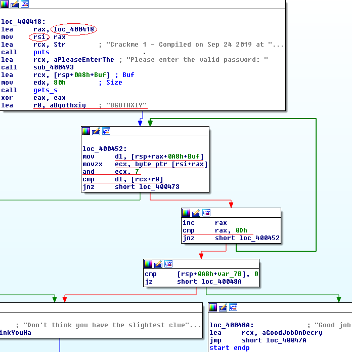

## raxer's Simple Crackme
source: https://crackmes.one/crackme/5ed5b3c833c5d449d91ae6d0

# Challenge

An exe file in waiting for a password

# Solution

I opened the exe with IDA and looked for the main function `start`:\


We can see that users password saved in __[rsp+0A8h+Buff]__.\
__rsi__ is equal to __loc_400418__.\
The first 13 bytes from __loc_400418__ after __and__ operation with 7 (__loc_400418__ [i] & 7), representing the index in the string __"BGOTHXIY"__\
Which is then compared with the character from the password string.\
I took the first 13 bytes of __loc_400418__ which are :  __" 48 8D 05 F9 FF FF FF 48  89 C6 48 8D 0D "__.
I made python scrip for finding the right password.
```python
string="BGOTHXIY"
hexr="48 8D 05 F9 FF FF FF 48  89 C6 48 8D 0D".split()
print(hexr)
for i in range(13):
    print(string[int(hexr[i],16)&7],end='')
```

__output__: BXXGYYYBGIBXX Which is our solution.
