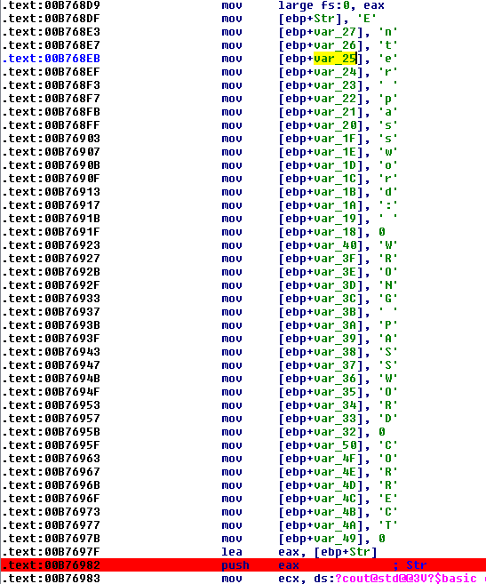

## cryptexx's no strings attached
source: https://crackmes.one/crackme/5f1ec95e33c5d42a7c667b0e

# Challenge

An exe file in waiting for a password

# Solution

I opened the exe with IDA, there are a lot of jumps and isdebuggerpresent checks.\
It is possible to trace dynamically and avoiding the `isdebuggerpresent` checks but there is no need for that.\
This is the code flow:\
**start -> start_0 -> sub_B78DD0 -> sub_B78DF0 -> sub_B790C0 -> sub_B7146F -> sub_B768A0**

__sub_B768A0__ will be our main function.

At __0xB768DF__ we can see the string generator for `enter password` , `wrong` , `correct`.

At __0xB769E1__ there is a conditional jump which indicates that one of the last function is a comparing function.\
After few checks, __sub_B71352__ which jumps to __sub_B73A60__ set the string __encrypted-c-string__ to a variable\
which is the correct password.

solution: __encrypted-c-string__
