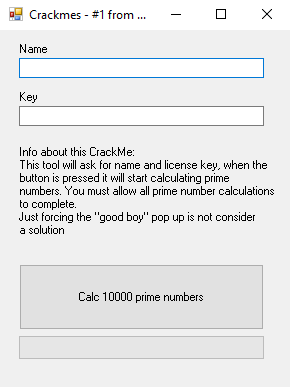
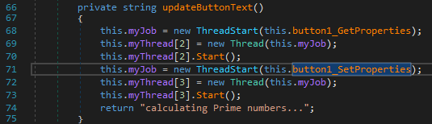
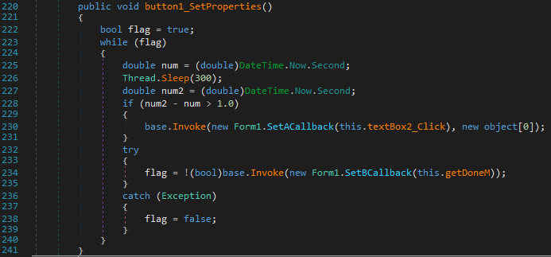
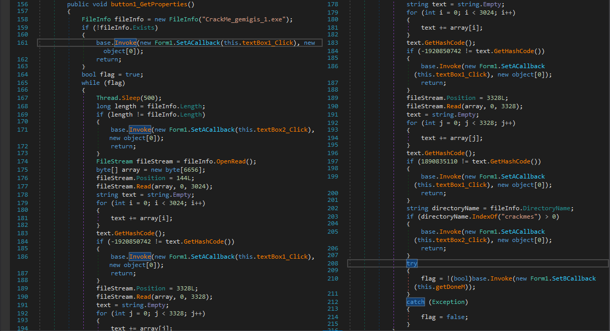
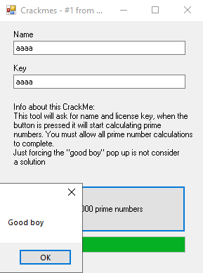

## gemigis_1 by gemigis
source: https://crackmes.one/5ab77f6633c5d40ad448cc6b

# Challenge

An exe file that asks for __Name__ and __Key__.\
And readme.txt file that says:\
```
Hi,
Hope you like this crackme.
Feel free to do whatever you like with the exe. The goal is to finish the prime number calculation.
Make a KeyGen, patch, self key, do whatever you like ;) but please write a tut or let me know how you did it.
Good luck
```



# Solution

I opened the exe with die.exe and it says that this is a __.NET__ application.


After openning the exe with dnSpy, under `Form1` there is `button1_Click` method.\
The important suff here is: `updateButtonText()` `BackgroundThreadProgramWork` and `CheckPassword()`.\


I will start with __updateButtonText()__:


This method opens another 2 threds: `button1_GetProperties` and `button1_SetProperties`.



Simple make a sleep for __300 ms__ and if it took more then 1 sec its ends the leading to __bad boy__.\
Because the autor said we can path I will change the code.\

from:
```C# 
num2 - num > 1.0
```
To:
```C# 
num2 - num > 50.0
```

Now __button1_GetProperties__:\


The `(!fileInfo.Exists)` chackes if the file name is `CrackMe_gemigis_1.exe` If not exis.\
The `(-1920850742 != text.GetHashCode()` chackes if we made changes to the program so I made is:

```C#
-1920850742 == text.GetHashCode()
```
Because we will make changes.\
For some reason the instraction `1890835110 != text.GetHashCode()` is False, __text__ is the hash of the sum of the empty array.\
I chaged it to:
```C#
1890835110 == text.GetHashCode()
```
The the next instruction in __button1_Click__ afetr creaing the __updateButtonText__ thread is __BackgroundThreadProgramWork__\
Which just calculates 1000 primes and exists doesnt make any problem.\

The next instresting method is __CheckPassword()__


__a__= the hash of the `Name`\ 
__b__= -1 + the hash of Key \
Because its hard to find which Name has a hash of -1+`number` and the `number` represent hash of another string.\
I changer __b__ to:
```C#
b = Convert.ToString(this.textBox2.Text.GetHashCode());
```
So now simple the `Name` and the `Key` must match.



