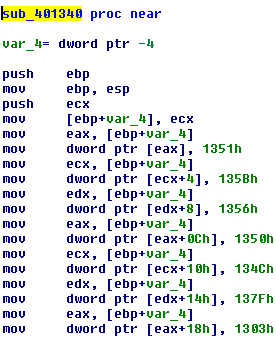
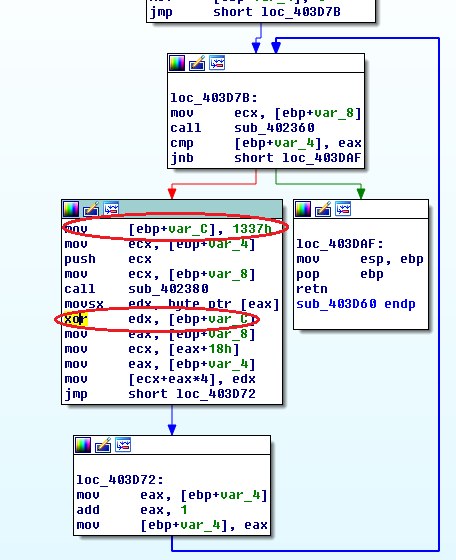

## lexXxus's lexXxus crackme 1.1
source: https://crackmes.one/5d6abb3833c5d46f00e2c37b

# Challenge

An exe file that asks for the flag

# Solution

I opened the exe with IDA and looked for the strings.\
The most interesting strings are: `Enter the flag:`,`NO`,`YES, you've got it`.\
By cross-referencing I got to the funtion __sub_403B90__, The funtion __sub_403B40__ which is called at\
__0x403C34__ decide wether its good or bad password.

The most instersting function is __sub_401340__:\

Which stores some numbers in some kind of array.\
At privious call for __sub_403DE0__ which calls to __sub_403D60__:\

There is a loop with a __XOR 1337h__ seems like encryption/decryption, after xoring the values from the __sub_401340__ I got this\
__flag{H4v3_4_n1c3_r3v3rs1ng_w4Y}__ which is the solution.

I made a python script for that [solution.py](solution.py)
