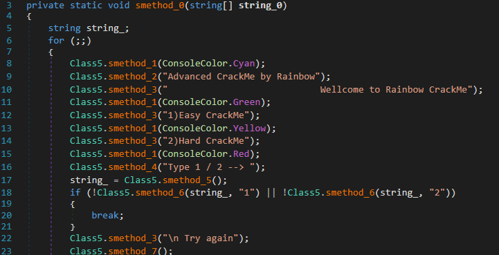
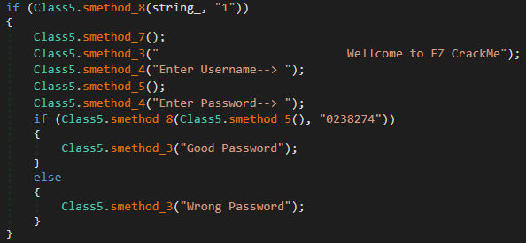
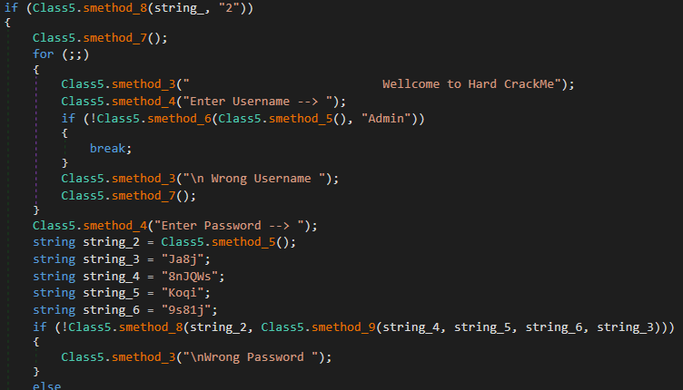

## RainbowDash's Advacned CrackMe v1.0
source: https://crackmes.one/5ab77f6633c5d40ad448cc6b

# Challenge

A 2 mode crack me hard and easy

# Solution

I opened the exe with die.exe and it says that this is a __.NET__ application and protected with `Confuser X`.\

The deobfuscation. I opened the program with __dnSpy__, went for `<Module>` .cctor, brakepoint on `gchandle.Free()`.\
Run, and saved `koi` Module from Modules window.

The koi needs to be cleaned. I used open source __de4dot-cex__.\
I opened the cleaned koi with __dnSpy__.

The main function seems to be __smethod_0__ in __Class5__.\

### For the easy mode (1):

There is no check for username only the password __0238274__

### For the hard mode (2):

The username: __Admin__ password: __8nJQWsKoqi9s81j9s81j__
