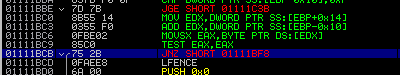

## n30np14gu3's Password Keeper
source: https://crackmes.one/crackme/5e68f77d33c5d4439bb2de0c

# Challenge

An exe file in waiting for decrryption password \
And an passwords.db file (which is empty)

The description is: `Enter correct password for getting flag ;)`

# Solution

Opened the exe with OllyDbg and paused after the `Invalid Password` massage error.\
By looking at the callstack its seems that `0x13914CB` decide wether the password is true or not.


I put Break point on `0x13914CB` and run again the exe till pause.\
There are few checks I will fouces the main ones in order to find the key.\

\
The check at `0x1111BCB` check if the next character in our password is __0__ or basicly its iritate on our pass,\
the char is save at `EAX` for later use.

\
Here the `EAX` which store the letter is moved to `ECX`.\
`EDX` is storing characters for `[ECX]` and by chacking at the dump section we can see this:


At `0x1111C01` `EDX` is XORed with `0x13` , because `0x13` XOR `0x13` is __0__ I asumed that the hex value `0x13`\
is the end of the password.\
So every character from my input is compered with the  XORed `0x13` value of every character from `[ECX]` (showen in the dump section).

The next C code which will find the right password:

```C
#include <stdio.h>

int main() {
   char arr[]={0x75,0x66,0x70, 0x78 ,0x7A ,0x7D, 0x74 ,0x4C ,0x7E ,0x23 ,0x61 ,0x75 ,0x7A,0x7D,0x74};
    for ( int i = 0; i <= sizeof(arr) ; i++ )
    {
    printf("%c", (char)(arr[i]^0x13)); 
    }
  return 0;
}
```

The output is :__fucking_m0rfing__


The flag for this challnge is: __shb{Vir7u41_pr073c7_xD}__

