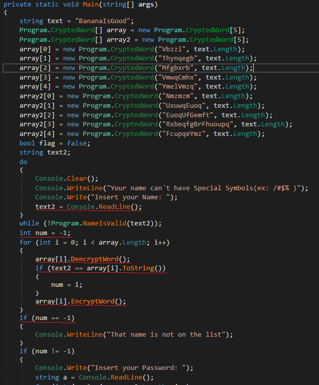
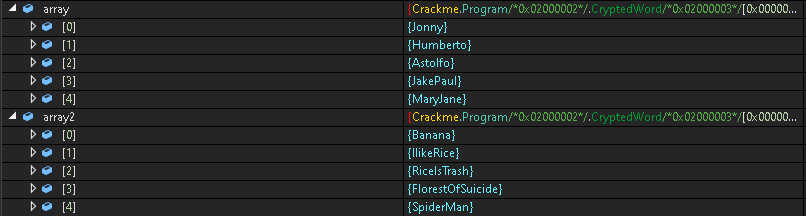

## Rreis019's Medium Crackme
source: https://crackmes.one/5ed7c63233c5d449d91ae6f6

# Challenge

An exe file named `CracMe.exe` ask for `Name` and `Password`
# Solution

I opened the exe with die.exe and it says that this is a __.NET__ application. So I will use Dnspy here:\

`Note: the input of the name must be valid: only characters`\
This is part of the main function. This code is straight forward.\
There are 2 arrays, __array__ --> name array __array2__ --> password array, Because __text2__ which is name compered to __array__ and later on\
__a__ which is password compered to __array2__.

From the first for loop, we can see that the values in __array__ get decrypted and if are equal to user `name` the index of the `name` saved in __num__\
for verification with the password.\
If `name` not found in the __array__ __num__ will be equal to -1 and will not check the passwords.

I will edit the main method and i will earse the instractions of __array[i].EncryptWord()__ and __array1[i].EncryptWord()__.
I also edited __num=-1__ to __num=0__

Now we can simply put a breakpoint on  __if (!flag)__ and we will able to see
all the decrypted values in __array/array2__.

### The matching between names and passwords

 __Name : Password__
* Jonny : Banana
* Humberto : IlikeRice
* Astolfo : RiceIsTrash
* JakePaul : FlorestOfSuicide
* MaryJane : SpiderMan
