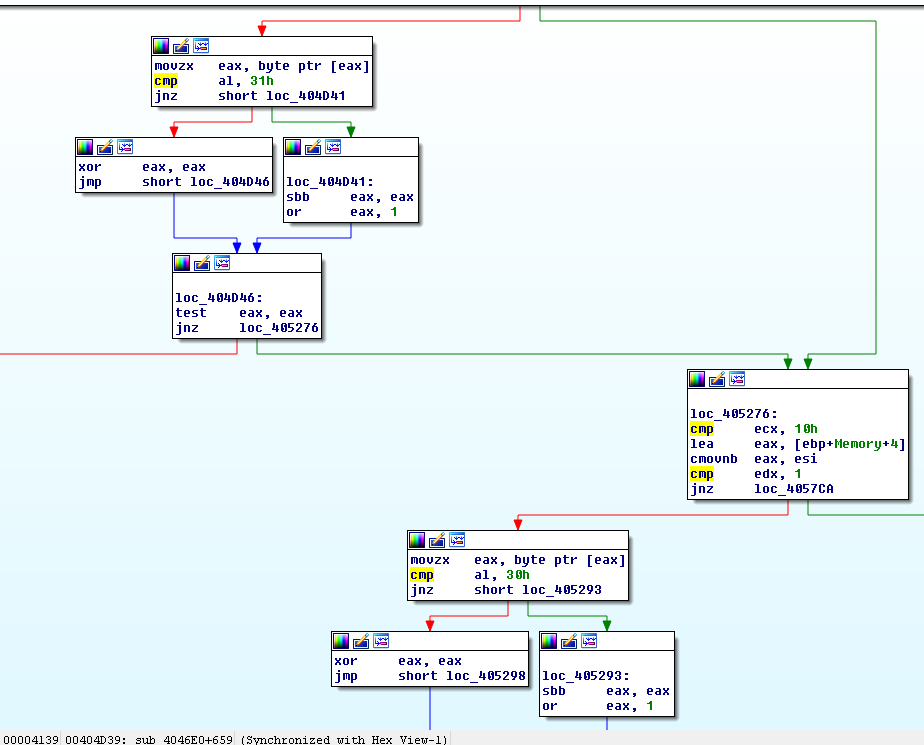
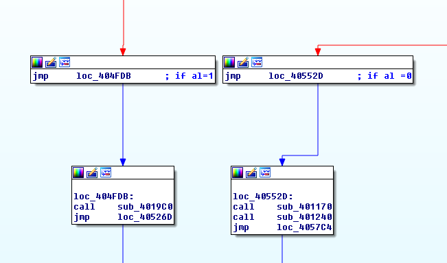
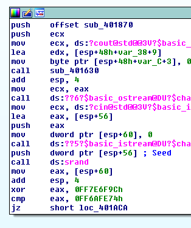
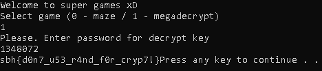
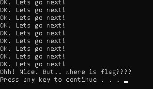

## n30np14gu3's WTF(Where This Flag)
source: https://crackmes.one/crackme/5e82f7c733c5d4439bb2e037

# Challenge

An exe file  that askes us for input \
* **0 -maze game**
* **1 -megadecrypt game**

The description of the challenge is
``` 
There are three flags in this program.
The first flag is in the maze.
You will get the second flag by guessing the decryption password.
The third flag is hidden in the depths of the program.
```

# Solution

## The second flag
I opened the program with IDA and traced the function that decide if we input `0` or `1`, by cross referencing\
the string `Welcom to maze game` the string used in `sub_401170` which called by `sub_4046E0`.\
Immidiatly the `cmp     al, 31h` at `0x404D39` and `cmp     al, 30h` at `0x40528B`


If `al== 1 or 0` we get here:


Under maze game we can see the 'sub_401170' from earlier if we follow `sub_4019C0` 


The number we input is stored in us XORed with `0FF7E6F9Ch` and then compered with `0FF6AFE74h`\
So if __number xor 0FF7E6F9Ch=0FF6AFE74h__ ---> __number=0FF6AFE74h xor 0FF7E6F9Ch__ ---> __1491e8 (1348072)__
 // 1->1348072 ->key

The second key is: __sbh{d0n7_u53_r4nd_f0r_cryp7!}__

## The first flag
I opened the program with olly and brake point at `sub_401170` every time I step over this functiion in the\
dump window `adwdasswaswsadsdadadasswwdawwdadaaddwdadasswwdwdaaddasaswsssaswdassdadda` shows up, every time the same string.\
indeed if this string is inputed in the maze game this window pop-up:


One of the hints are that the key is encoded in the path `adw...` after tring adifferent combination, 
treating `w,a,s,d` as `0 1 2 3` when `a` is not `0` (don't make seanse) \
I got this string **130312201202132313131220031003131133031312200303113312120222120312231331 or in hex 
7368627B776834375F3768335F662A636B7D ---> shb{wh47_7h3_f*ck}**

The first key is: __shb{wh47_7h3_f*ck}__


