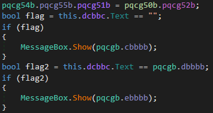
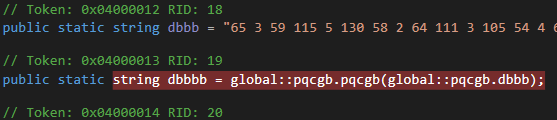
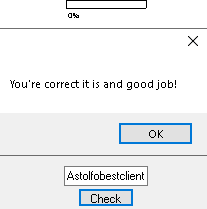

## thesaviorsrule's The Ultimate Crack Me
source: https://crackmes.one/crackme/5ebb6ba233c5d4761174664d

# Challenge

A windows that asks for password

# Solution

This program was written by __.NET__, Detect It Easy verified it.
I opened the exe with `Dnspy`. Go to entry point revale that the staty of the code is at the method __fbbbc()__,\
Which crates an oblject of __mQbbb()__. At ____mQbbb()__ __fbbbc()__ and __hbbbc()__ compares `Text` to some global variable.\
__fbbbc():__

__hbbbc__ looks the same but without the compare to `""`.

by clicking at __pqcgb.dbbbb__ I got here:

I put a brake point at the instracion, steped into __pqcg()__ and run untill return. The returned text will be our string.\
The text on return is __Astolfobestclient__ which is the correct flag.

