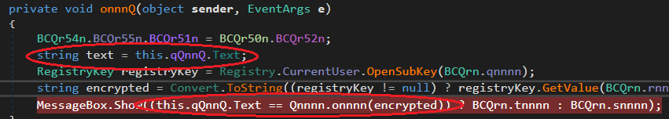

## thesaviorsrule's Crack Me Reborn V2.0
source: https://crackmes.one/crackme/5ed7537f33c5d449d91ae6f0

# Challenge

An exe file with a text box in format of password text box:

# Solution

This program was written by __.NET__ , Detect It Easy verefide it.
After opening the exe with `Dnspy` the classes and methods seems to be confusing on porpuse:\

After some time its was easy to detect the `Form` main mathod and its __ctor__, the form named __Qnnnn__,\
and the __ctor__ is __unnnQ()__:\

In red can be seen the method that being called when clicked __onnnQ__, its the only click method so i assume that its `button click`.\

### onnnQ
Saves user input in *text* then take hard-coded  __encrypted__ and retrive the hard coded password, It can be easly traced.\
But to solve this CrackMe there is simple solution, all its takes is to put Brack Point on the __MessageBox__ instruction,\
Debuge the program, Enter any password you want after the `Dnspy` brakes just step over (F10) and the right password will be in the `Locals` window.\

And its pretty self explainable, `Qnnn/../.onnn/../ return ` is the return of `Qnnnn.onnnn(encrypted)`,\
and its checks if text equal to this string.

__Flag= godpowisacraftyfellow__

