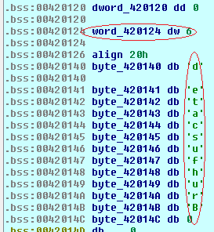

## Pelusteach's Littered
source: https://crackmes.one/5edf946033c5d449d91ae78e

# Challenge

An exe that askes for __key__.

# Solution

As the author notes, the program was obfuscated with `junk code`. IDA easily verifies that.\

There are a lot of useless __pusing poping and moving__. Next, I tried to look for interesting strings.\

Indeed the string __" What is the key? "__ appear there cross-referencing leads to this area of the code:\

The function __puts__ used here to store the user's key string. It's also possible to find the __gets__ function to see where the key\
is being stored by there is no need for that.\
By scrolling further in the code I found this instruction which seems odd in all this junk code which is good sing for non-junk.\

By cross-referencing its seems to be important, there are 6 different uses of that.
I because this __word__ doesn't store any value I assume that the program stores there value in run time. IDA debugger will help here.\
I put a breakpoint on `loc_40B133`.\

The instraction in `loc_40B133` seems to store the length of the input key __word_420124 = key len__ `(multiple runs verefies it)`\
On the other hand __byte_420140__ to __byte_42014B__ --> __detacsufhurB__ look interesting.\

So our flag is: __detacsufhurB__
