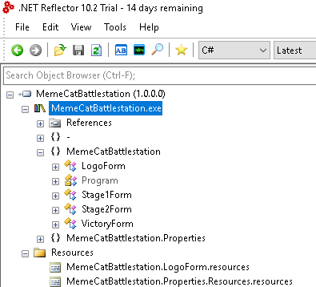
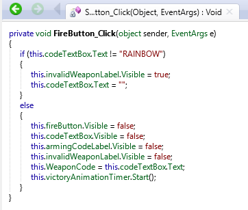
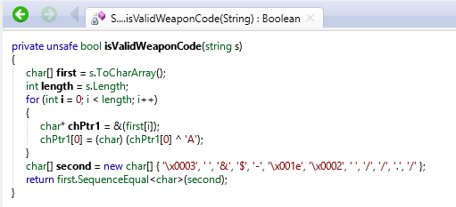

## Level 1
challenge name:__Memecat Battlestation__\
source: http://flare-on.com/

# Challenge

An exe that waits for code as key and Message that describes the challenge

```
Welcome to the Sixth Flare-On Challenge! 

This is a simple game. Reverse engineer it to figure out what "weapon codes" you need to enter to defeat each of the two enemies and the victory screen will reveal the flag. Enter the flag here on this site to score and move on to the next level.

* This challenge is written in .NET. If you don't already have a favorite .NET reverse engineering tool I recommend dnSpy

** If you already solved the full version of this game at our booth at BlackHat or the subsequent release on twitter, congratulations, enter the flag from the victory screen now to bypass this level.
```


# Solution

The program is written in C# .NET so Reflector (.NET decompiler) may be helpful.



If we go to the void function `FireButton_Click` there is a comparison between the text box and the string `"RAINBOW"`\


And it's the correct code for stage1.

Next, we have another code we need to enter stage 2. By looking at the stage2 Form,\
there is a function call named `isValidWeaponCode` which takes our input value.


There is a the function XOR every char by 'A' stores is in char array and comperes it with the char array
```
['\x0003', ' ', '&', '$', '-', '\x001e', '\x0002', ' ', '/', '/', '.', '/']
```
``` C#
char[] code = new char[] { '\x0003', ' ', '&', '$', '-', '\x001e', '\x0002', ' ', '/', '/', '.', '/' };
for(int i=0; i<code.Length;i++)
{
Console.Write((char)(code[i]^'A'));
}
```
and the output is: __Bagel_Cannon__ which is our code for stage2 and we get the flag:__Kitteh_save_galixy@flare-on.com__
