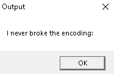
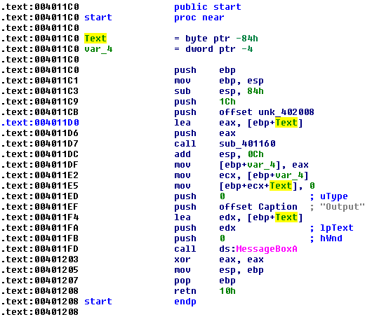
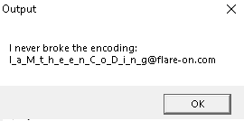

## Level 2
challenge name:__Overlong__
source: http://flare-on.com/

# Challenge

An exes that tells us `I never broke the encoding:`, and text message 
```
The secret of this next challenge is cleverly hidden. 
However, with the right approach, 
finding the solution will not take an <b>overlong</b> amount of time.
```



# Solution
I open the program with IDA, the main function is `start` at `0x4011c0` which call the `MessageBoxA` function at the end.\
At `0x4011CB` the `offset unk_402008` is being push with `1Ch (28)` at right after the `sub_401160` is called.\


The data at `unk_402008` seems encrypted.\
At `eax` which equals `[ebp+Text]` is also being pushed, and this `[ebp+Text]` is used to Print the message.\
This might tell us that the decrypted data at `unk_402008` is stored at `[ebp+Text]` for the message box.

After so tries with ollyDbg the `1Ch` that was pushed to `sub_401160` determine the length to encrypt out of `unk_402008`.\
The `unk_402008` actual size is `AFh` if we modify the `1Ch` to `AF` at the push instruction the next line is being overwritten,\
so it can be modified in the stack.



The flag is: `I_a_M_t_h_e_e_n_C_o_D_i_n_g@flare-on.com`
