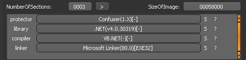

# WeliveSecurity
## Challenge 

An exe that waits for our input everything is in Spanish but the red cross seems that our input is bad.


## Solution

Die( packer identifier) detect that this program is base __.NET__ and uses the protector __Confuser 1.X__


If I opened this program with dnSpy to make sure that this is using obfuscation.
I will use `de4dot` .NET deobfuscator and unpacker for the deobfuscation.
For some reason, the program doesn't run after the deobfuscation but we can still solve this statically.
After some analyzing, __Form0__ doesn't seem to have some valuable information.
The function __Button1__ in Form1 runs the `method1` when clicked.\


And the method1 passes the text from `TextBox1` using `smethod1` for this.
The text is passed then to `method_2`


### method_2
* gets the `Textbox1` text as __string_0__ 
* runs `method_3` 
* checks if the length of __string_0__ is 15
* XOR every letter by __31__ and then coperes to `method_3` using `smethod_9` which is simple `Operators.CompareString`


### method_3 
* Every string from `array` which are numbers converted to `Int32` using `smethod_12`
* `smethod_4` takes __string__ and return the `char` value of the index int(array)
* `smethod_7` convert `char` to `string`
* `smethod_8` add the `char` from `smethod_7` to text
* the __text+char__ puted to __text__

This simple python script find the value of __text__
```python
lst="85,79,75,29,84,78,89,83,29,84,75,69,76,86,27".split(',')
string_="!#$%&()*+,-./0123456789:;<=>?@ABCDEFGHIJKLMNOPQRSTUVWXYZ[\\]_abcdefghijklmnopqrstuvwxyz{|}~"
for i in lst:
    smethod_12=int(i)
    smethod_4=chr(ord(string_[smethod_12]))
    print(smethod_4,end='')
```
__text=ztp@ys~x@ypjq{>__

### Back to method_2

The first for loop gets __string_0__  manipulate it and saves the manipulation to __string__
* by `smethod_4` takes the char I'm in our __str_0 (user input text)__ 
* `smethod_5` convert the `char` to `int` XORing the value with 31
* `smethod_6` convert the new value to `char` and `smethod_7` to `sting`
* `smethod_8` adds the new value to __string__
* __string_ __ compered to __ztp@ys~x@ypjq{>__ `method_3's` output

So basicly if we xor this with 31 we sopose to get the expected value from the user.
```python
text="ztp@ys~x@ypjq{>"
for i in text:
    print(chr(ord(i)^31),end='')
```
__flag=eko_flag_found!__


