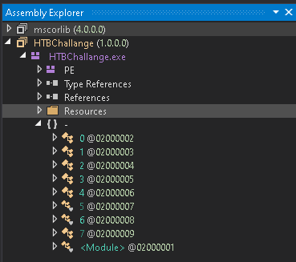
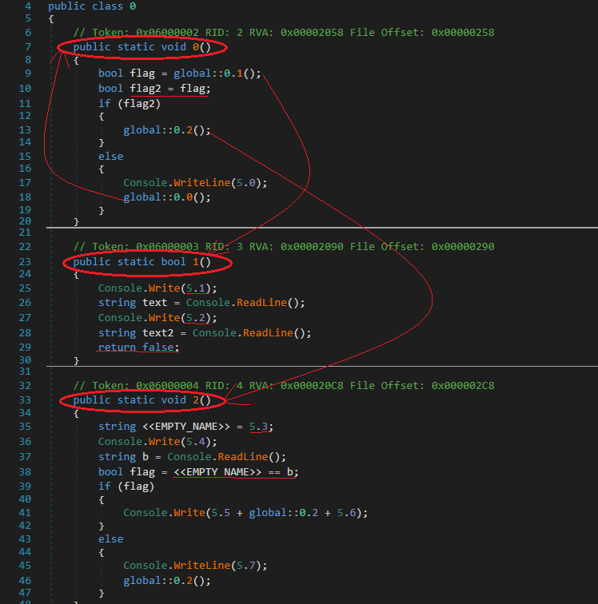
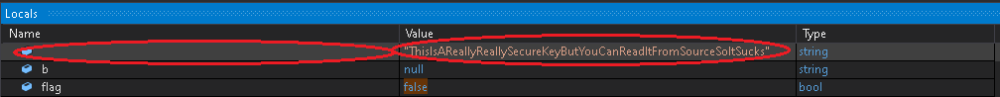

## Bypass by Baikuya
source: https://www.hackthebox.eu/home/challenges/Reversing

# Challenge

An exe file that waits for **username** and **password** 

# Solution

I opened the file with  Detect It Easy and which says this is __.NET__ Program. I opened it with Dnspy there are a lot of different classes.\

After some debugging, I found the class `0`:\

First the void method `0` is called and __flag__ is equal to the return from the method `1` which is always __flase__.\
Method `1` printing `5.1` and `5.2` which is __username__ and __password__. This user-information is irrelevant.\
Or __flag__'s which is __false__ passed to __flag2__ so the `if(flag2)` will never be executed. But the else prints `5.0` witch is __Wrong username and/or password__.
I will dynamically change __flag__'s value to __true__ while debugging in Dnspy its easily done by the local's window below.

After the change `0.2()` is executed which is method `2` in class `0`.
method `2` move `5.3` to __<<EMPTY_NAME>>__, prints `Please Enter the secret Key:` .\
Users input saved to __b__ and compered to __<<EMPTY_NAME>>__.\
By puting brake point on the coparison its easily seen in the locals window that\
__<<EMPTY_NAME>> = "ThisIsAReallyReallySecureKeyButYouCanReadItFromSourceSoItSucks"__

So I changed __b__'s value to __"ThisIsAReallyReallySecureKeyButYouCanReadItFromSourceSoItSucks"__\
And the output is:__Nice here is the Flag: HTB{SuP3rC00lFL4g}__

So the solution is __HTB{SuP3rC00lFL4g}__
