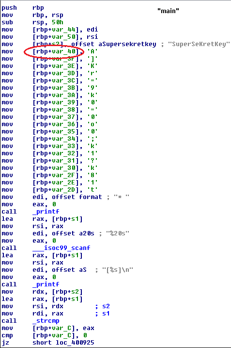
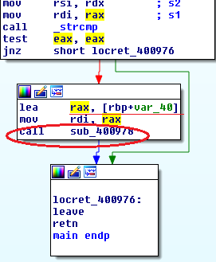
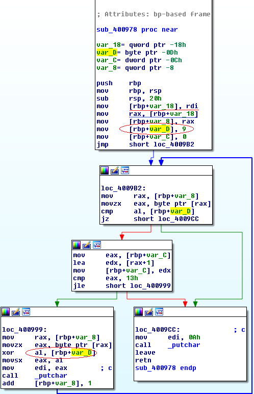

## Impossible Password by decoder
source: https://www.hackthebox.eu/home/challenges/Reversing

# Challenge

An `impossible_password.bin` file 

# Solution

I used only IDA pro for this challenge.
Opened the file with IDA pro and head straight to main, There are 2 interesting strings, __SuperSeKretKey__ and __"A]Kr=9k0=0o0;k1?k81t"__


There are few comparisons and few checks but there is no need to dig deeper.\
Afer all comparisons and all the cheacks we get to the call of `sub_400978`\


__[rbp+var_40]__ contains the __"A]Kr=9k0=0o0;k1?k81t"__ from previous.\


There is a for-loop with a XOR. `rdi` which is __"A]Kr=9k0=0o0;k1?k81t"__ is moved to `rax` and `[rbp+var_8]`.\
`[rbp+var_D]` is 9, used for the XOR of the string __"A]Kr=9k0=0o0;k1?k81t"__.\
When we are done with all the 19(13h) characters exit.
So we need to XOR every char in __"A]Kr=9k0=0o0;k1?k81t"__ with `9`, I made this with python:
```python
s="A]Kr=9k0=0o0;k1?k81t"
new=""
for i in s:
    new+=chr(ord(i)^9)
```
The solution is: __HTB{40b949f92b86b18}__
