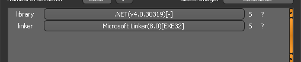
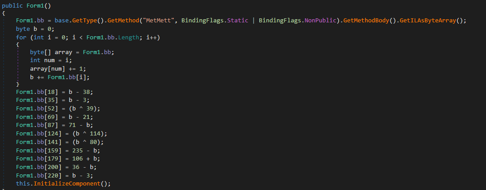

# CSHARP
source: http://reversing.kr/challenge.php

## Challenge
A `CSHARP.exe` that waits for input

## Solution

I scanned the program with `Detect It Ease(Die)` and it tells that the proram is written with __.NET__ `DnSpy` may help here:\


I opened that exe with `Dnspy`. And went to the buttenclick function __btnCheck_Click__  \
which pass our input text to the function __MetMetMet__:\


The most importent things here are:
* sss- our text converted to bytes array
* MetM- a method that saved under that name __method__ which __Form1.bb__ being passed to 
* array- 1 and 2 passed to the method __method__ with the our text 
* if array[0] is still 1 our input is wrong

### __Form1.bb__
We have to under stand what is __Form1.bb__ and __Form1.bb.Length__ to understand the method __method__.\
I analyzed the __Form1.bb__ paramter and found that Form1's ctor saves that method __MetMett__ to `bb`


__MetMett__ seems to be curapted and dont have any code in it, but the in __Form1()__ seem to manipulate __MetMett__'s bytes.\
Inside a for loop first its add __1__ to every byte in the method's opcodes and sums all the opcodes to __b__.\

After the for look __b=54__ and there is another manipulation of the opcodes I made a python script that fixes the __MetMett__ method.

```cmd
python patch.py CSharp.exe
CSharp_patched was created
```


