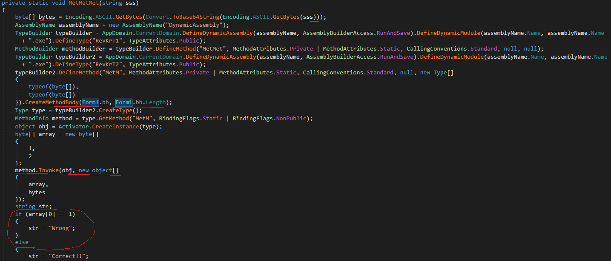

# CSHARP
source: http://reversing.kr/challenge.php

## Challenge
A `CSHARP.exe` that waits for input

## Solution

I scanned the program with `Detect It Ease(Die)` and it tells that the program is written with __.NET__ `DnSpy` may help here:\


I opened that exe with `Dnspy`. And went to the buttenclick function __btnCheck_Click__  \
which pass our input text to the function __MetMetMet__:\


The most important things here are:
* sss- our text converted to bytes array
* MetM- a method that saved under that name __method__ which __Form1.bb__ being passed to 
* array- 1 and 2 passed to the method __method__ with our text 
* if array[0] is still 1 our input is wrong

### __Form1.bb__
We have to under stand what is __Form1.bb__ and __Form1.bb.Length__ to understand the method __method__.\
I analyzed the __Form1.bb__ parameter and found that Form1's ctor saves that method __MetMett__ to `bb`


__MetMett__ seems to be corrupted and don't have any code in it, but the in __Form1()__ seem to manipulate __MetMett__'s bytes.\
Inside a for loop first its add __1__ to every byte in the method's opcodes and sums all the opcodes to __b__.\

After the for look __b=54__ and there is another manipulation of the opcodes I made a python script that fixes the __MetMett__ method.

```cmd
python patch.py CSharp.exe
CSharp_patched was created
```

The `CSharp_patched.exe` spouse to have fixed __MetMett__ this is the function that in it:\


This method XOR every char with a different number and compares it to another, if False __chk[0]=1__ which is our `array` from the check if __array[0]==1__ so we want to avoid it.\
If I will XOR the two sides for __bt[i]^a=b__ I will get __bt[i]=b^a__. \
I made a simple python scrypt for that :
```python
password=""
password+=chr(int(str(74^16),10))#0
password+=chr(int(str(87^17),10))#1
password+=chr(int(str(77^33),10))#2
password+=chr(int(str(70^51),10))#3
password+=chr(int(str(29^68),10))#4
password+=chr(int(str(49^102),10))#5
password+=chr(int(str(117^51),10))#6
password+=chr(int(str(238^160),10))#7
password+=chr(int(str(241^144),10))#8
password+=chr(int(str(226^181),10))#9
password+=chr(int(str(163^238),10))#10
password+=chr(int(str(44^17),10))#11
print("The pasword is",password)

The pasword is ZFluYWFNaWM=
```
This seems to be encrypted with Base64 and this is not the solution so let's try to decrypt it:
``` python
import base64
print("The pasword is",base64.b64decode("ZFluYWFNaWM=").decode("utf-8"))

The pasword is dYnaaMic
```


