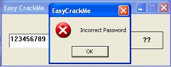

# Easy Crack
source: http://reversing.kr/challenge.php

## Challenge
we have an exe file that asks for some password 

## Solution
We open `Easy_CrackMe` in IDA we can see that `WinMain` call `DialogBoxParamA` and push the Function at address `0x401020`.

We follow the `401020` function and its call `sub_401080` which seems to be the function that decides if its good password or bad.
The code flow so far `WinMain`-->`401020`-->`401080`

We jump to ollyDbg at `401080`The `GetDlgItemText` function get the buffer address at 0x4010A3 as EAX which is a memory location we can see at `0x40109F`, are put there the password we enter.
right after at 0x4010B0, the second byte compared to 'a'(61h). (`_a`)
the rest of the password is moved to ecx, pushed to `0x401150` function with "5y". There the letters in the index 3,4 compered with "5y". (`_a5y`)

At `0x4010D1` we compere the rest of the password with "R3versing". (`_a5yR3versing`)
after that, we check that the first letter is 'E'(45h). (`Ea5yR3versing`)

Note: every jump to `0x401135` jumps to badboy "`Incorrect Password`"
      the goodboy is at the end of the check rutin at `0x401114`

The right password is *Ea5yR3versing*

