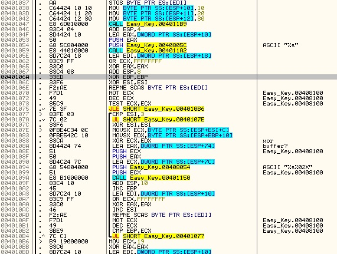

# Easy Crack
source : http://reversing.kr/challenge.php

## Challenge
We have and exe and Readme text file 
The exe wait for Name and serial, and the readme text file tell us to find the name that generate the serial 5B134977135E7D13.

## Solution
We open Easy_keygen with ollyDbg we follow the step over untill we get to the main function at `0x401000`.
The program saves the number `10` `20` `30` at `0x401038` for later use.
The program get the Name at `0x401059`, we have a loop over the Name we inputed from `0x401077` to `0x4010B4`.
The esi is a counter from 1-3 and its choose at `0x40107E` a number from the saved numbers `10` `20` `30`.
The first letter is xored with `10` the second with `20` the third with `30` the fourth with `10` again and so on.
Every xored number save at ecx with previous xored numbers which is memory location (see `0x401090`) the function at `0x40109A` called sprintf
the funtion add the previous numbers as longer string (see the format `%s%02x`) at `0x401094`.

At `0x4010e2` and `0x4010e6` we can see the the generated serial moved to `ESI` and the inputed serial moved to `EAX`,
we can see a loop from `0x4010EA` to `0x401108` that compare 2 bytes at the time and choose to jmp to the `badboy` or not.

The ReadMe.txt said we need to find the name that generate the sirial 5B134977135E7D13 from the sprintf format we know that every number added is length 2 
and we know that xor is Symmetrical means that a xor b=c, c xor a =b
the numbers we need to xor are `5B 13 49 77 13 5E 7D 13`
as we told the first will be xored with `10` the second with `20` and so on...
`5B 77 7D ` xor `10` --> `4b 67 6d `
`13 13 13` xor `20` --> `33 33 33`
`49 5E` xor `30` --> `79 6e`
combine back '4b 33 79 67 33 6e 6d 33' --> (ascii) `K3yg3nm3` 
