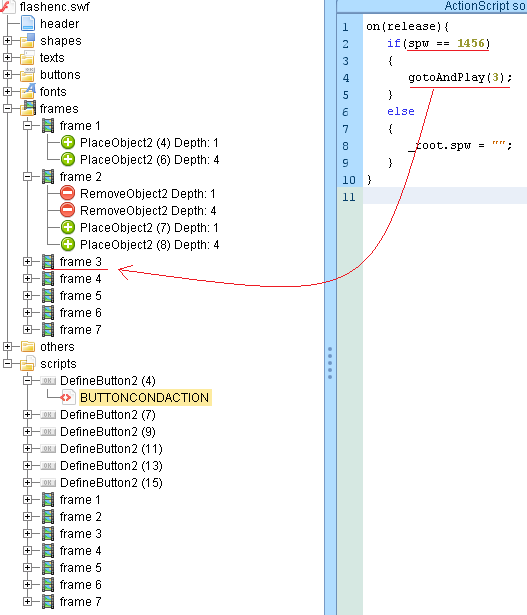
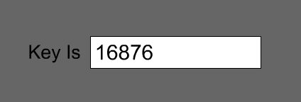

# Flash Encrypt
source: http://reversing.kr/challenge.php

## Challenge
A file named `flashenc.swf` that can be opened with the browser.

## Solution
I opened the file with [FF dec](https://github.com/jindrapetrik/jpexs-decompiler/releases/tag/version11.3.0),
the code seems to be obfuscated, FFdec has auto deobfuscation.

The first frame point to __DefineButton2(4)__ and there a comparisson between `spw==1456`, If true go to 3, the 3rd frame.
And so on.

* **Frame 1** --> button 4 `spw==1456` -->frame 3
* **Frame 3** --> button 9 `spw==25` -->frame 4
* **Frame 4** --> button 11 `spw==44` -->frame 2
* **Frame 2** --> button 7 `spw==8` -->frame 6
* **Frame 6** --> button 15 `spw==88` -->frame 5
* **Frame 5** --> button 13 `spw==20546` -->frame 7
* **Frame 7** dont lead us to button object

Meanwhile there was a varible __spw__ that was calculted, this will be the answear because frame 7 look like this:\

Its possible to calculate __spw__ but input the right __spw__ seems to be faster, This is the output:\

The answear: __16876__
