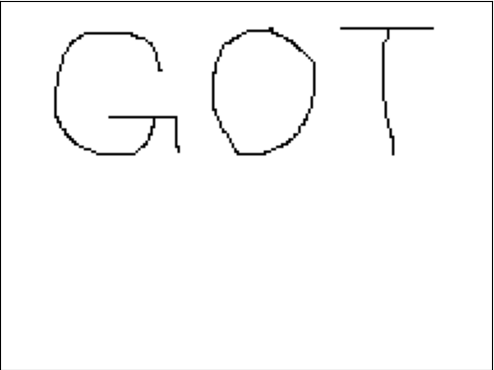

# ImagePrc
source: http://reversing.kr/challenge.php

## Challenge
we have an exe file, we can draw on it and click check, but we get `wrong` message. 

## Solution
I opened the `ImagePr` with ollyDbg and after the `wrong` message pause the program.
After looking at the call stack I got here.

The jump `JNZ SHORT ImagePrc.004013CD` at `0x4013AA` jump to our `wrong` message and if to jump or not decided at the `CMP DL,BL` at `0x4013A8`.

At `0x401381-0x401397` we can see Resource loading there is only one resource file the picture from Resource Hacker:

Because the the location of the loaded resource is in `EAX` and `EAX's` value is moved to `BL` we will asume that `DL` is the values from the program.

Now, we know that the number `FF or 00` seems to be the code for the image, the name of thats challenge is ImagPrc what means we need to get the original picture.
The resource section have 9060 bytes we need to check the window parameters to try and convert it to the original picture.

If u step over this routine and the `ShowWindow` few lanes later the program's window will show up.
We can see that the `Height is 150 and the Width is 200` whitch makes `3000` the picture is made with `RGB` which adds up to `9000`.

I parsed the image data with the next script

`import numpy as np
import matplotlib.pyplot as plt

ImagePrc = np.fromfile('Manifest101.bin', dtype = np.uint8)
ImagePrc = ImagePrc.reshape([150, 200, 3])
plt.imshow(ImagePrc, origin = '')
plt.show()`

`Note: this is the solution, I tried to draw this on board but it was too difficult`
