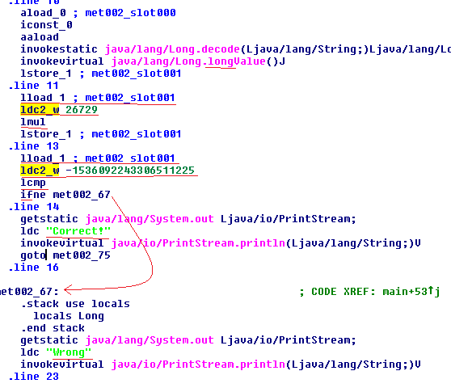

# Multiplicative
source: http://reversing.kr/challenge.php

## Challenge
A file named `JavaCrackMe.jar`.

## Solution
I opened the file with IDA and this is what in __JavaCrackMe.class__:\


The input saved in __met002 slot001__ then multiplyed by __26729__ and then compared to **-1536092243306511225**\
Because **-1536092243306511225** is not devided by __26729__ its seems like its the reasult of over flow,\
when long is larger then 2^63,The number becomes negetive.\
So our number __a*26729=-1536092243306511225__ or __a*26729__ __=n*2^64-1536092243306511225__ \
we will need to find that number first to find a.\

The next python scrip will do that
```python
while True:
    if (number * 2 ** 64 - 1536092243306511225) % 26729 == 0:
        print('number = %d' % number)
        break
    else:
        number += 1
Output:13720
```

That means __13720*2^64 -1536092243306511225__ is the first number devided by __26729__ so we can find a*26729.\
If we will devide the number above by __26729__, Big number=a .
But a must be a `long` number so we will need to subtract ecery overflow (2**64):\
```python
big_number = (13720 * 2**64 - 1536092243306511225) // 26729
if big_number > 9223372036854775807:
    big_number -= 2 ** 64
print('big_number = %d' % big_number)
```

__big_number = -8978084842198767761__ 

