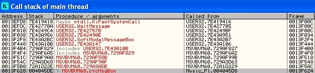
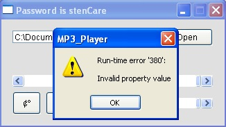
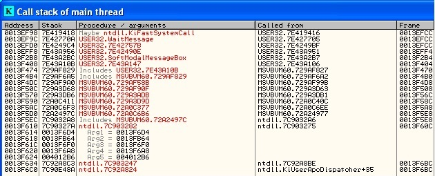
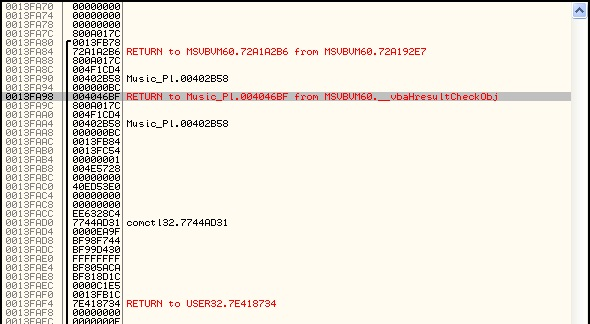
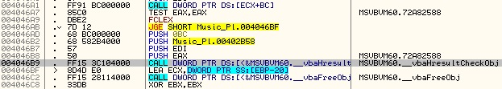
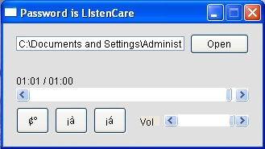

# Music Player
source: http://reversing.kr/challenge.php

## Challenge
We have an exe that seems to be a music player.
A readme text file that says the player limited to 1 min, and we have played if for more then 1 min to get see the perfect plag.
We also have an `msvbvm60` DLL file

Note: I added a song longer than 1 min for solving this challenge 

## Solution

We load the exe to olly and immediately we can see that it has a lot of jumps, so to find the main routine and the check routine we will run the exe with ollyDbg and pause after the limited 1 min error shows up. We must open the file first and click play (the left button).
After clicking pause we go to call stack and we can see that the message box was called from `0x4045DE`

After scrolling up you can see that the routine starts at `0x4044C0` after jumping from `0x4023C5`.
If we scroll up from the `0x4045DE` line we can the comparison `CMP EAZ,0EA60`, `EA60h = 60000`. It seems like its the comparison if the time is less them `60000ms` which is `60 sec` if `EAX>EA60` show error message.
In `0x40455D` we can see that the value from `EBP-A4` moved to `EAX`.

I will try to patch the jumps at `0x40456B` so the jump will be taken no matter what time passed.

`0040456B JL Music_Pl.004045FE `----> `0040456B JMP  Music_Pl.004045FE `

We save the patch to knew exe `Music_Player1.exe` after running it we get an error 

It seems like the password we are looking for is `stenCare` but to know for sure we will try to find where the error coming from.

We open exe with ollyDBG run until the error message after that we pause and look at the call stack like before.

Nothing helpful, we look at the stack and we scroll down (a lot) until we arrive here, the first function that returns to our main code.

The function that leads to the error message return to `0x4046B9F` what tells us that the function at `0x4046B9` caused the error massage the function `_vbaHresultCheckObj` (what this function does not seems to bother us to solve this challenge)

We see that the conditional jump at `0x4046AB` decides if jump over the error function or not.
I patched the jump

`004046AB JGE SHORT Music_Pl.004046BF` ----> `004046AB JMP SHORT Music_Pl.004046BF`

Save the changes to `Music_Player2.exe` and its working

As u can see the password is `LIstenCare`

`Note: The exe didn't work for me at the start I changed the Compatibility mode to windows 2000 at file-->Properties--> Compatibility-->Check the "Run this program in compatibility mode for : Windows 2000"`

