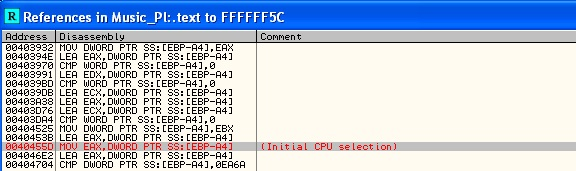

# Music Player
source: http://reversing.kr/challenge.php

## Challenge
We have an exe that seems to be a music player.
A readme text file that says the player limited to 1 min, and we have played if for more then 1 min to get see the perfect plag.
We also have an `msvbvm60` DLL file

Note: I added a song longer than 1 min for solving this challenge 

## Solution

We load the exe to olly and immediately we can see that it has a lot of jumps, so to find the main routine and the check routine we will run the exe with ollyDbg and pause after the limited 1 min error shows up. We must open the file first and click play (the left button).
After clicking pause we go to call stack and we can see that the message box was called from `0x4045DE`

After scolling up you can see that the routine starts at `0x4044C0` after jamping from `0x4023C5`.
If we scroll up from the `0x4045DE` line we can the comparison `CMP EAZ,0EA60`, `EA60h = 60000` . Seems like its the comparison if the time is less them `60000ms` which is `60 sec` if `EAX>EA60` show error message.
In `0x40455D` we can see that the value from `EBP-A4` moved to `EAX` we click on find references to the `EBP-4A` address.

