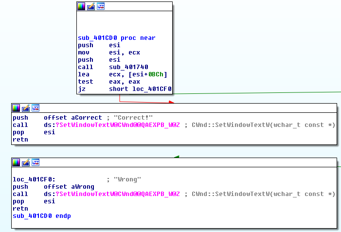
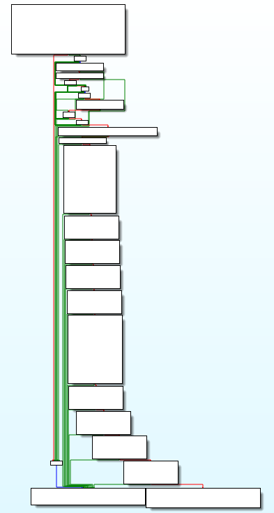
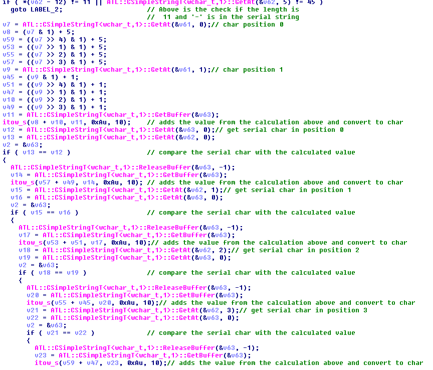
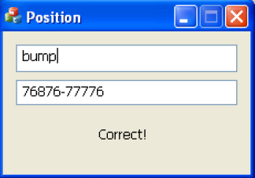

# Position
source: http://reversing.kr/challenge.php

## Challenge
A `Position.exe` and `ReadMe.txt`:
```
ReversingKr KeygenMe


Find the Name when the Serial is 76876-77776
This problem has several answers.

Password is ***p
```

## Solution

I opened the exe with IDA pro and looked for the `Wrong` sting in the string window.\
The cross-reference sends us to `sub_401CD0`:\


Which checks if the return value of the `sub_401740` function is 0 or not.\
`sub_401740` looks difficult but its pretty easy IDA's Psrudocode did a great job.\
All this function does is to check if there are valid inputs and make a simple calculation to see if the name matches the serial\
\
\

### valid inputs:
* for the name: non-repeating characters length 4
* for serial: 5 numbers followed by '-' and another 5 numbers

### name serial match
The code takes every character shift it's by the numbers 1-4 and adds 1 or 5 depend if the char location is even or odd .\
Then it takes the next character (int pairs) and sums the value its got from the other character and matches the values to with the serial.\
I added blow pard of the Pseudocode code that was generated by IDA and I added few comments to make it more readable.\
\


There is the same calculation for char in position 2 and 3, I made a simple python script that takes the Name and gives u the serial And vice versa,\
look for `Solution.py`

```
python Solution.py
bump
```

Our solution for the serial __76876-77776__ is __bump__\
\


`Note: the python script takes the first valid name and exits there are more solution for every serial the problem wanted a serial 
That ends with 'p' so I return the first valid name`
