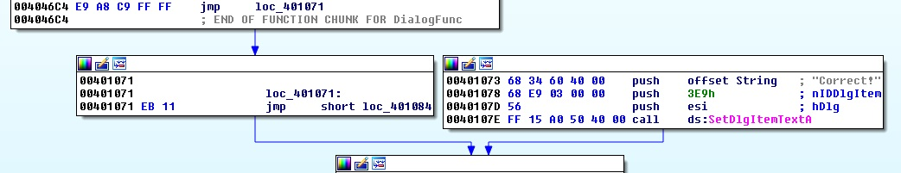

# Replace
source: http://reversing.kr/challenge.php

## Challenge
we have an exe file that asks for some input 

no matter what we input the program chrashes

## Solution
We open `Replace` in IDA we can see that `WinMain` call `DialogBoxParamA` and push the Function at address `0x401020`.

If we look at the end of the `sub_401020` we can see at `0x4046C4` jump and the another jump at `0x401071` which takes 2 byes to execut, if we could nope then (`EB 11 ---> 90 90`) the next line would be `0x401073` and as u can see its the good boy

We follow the `401020` function and its call `GetDlgItemInt` at `0x40105A` which seems to save our input at `dword_4084D0` lets call this input x.

Later the function `sub_40466F` being call it calls `0x40467A`, in `0x40467A`  `619060EBh` being saved at `dword_406016` and the code jump to $+5 meaning 5 bytes from this location (`0x404684`+5)=`0x404689`.

at `0x404689` the `dword_4084D0` being increased whats lead `dword_4084D0`=`x+1` (from before) 
The code retns to the next line after the `0x404684`-->`0x404689` that increase `dword_4084D0` again so is equal `x+1+1`,
the reurn code now is the return for the `call loc_40467A` that was called at `0x40466F` so the return address is `0x404674` which is unanalysed code 

after analyse

we can see that `601605C7h` is added to `dword_4084D0` that means that `dword_4084D0=x+1+1+601605C7`
and again `dword_4084D0` increased after the call to `0x404689`--> `dword_4084D0=x+1+1+601605C7+1`
the return send us to the next line aftert the call to `0x404689` which is `0x404689` so again `dword_4084D0` increased . so `dword_4084D0=x+1+1+601605C7+1+1`

the retun now return us to `0x40106A` the next line after the call to `sub_40466F`
`EAX` set to `0` and `dword_4084D0` moved into `EAX=x+1+1+601605C7+1+1`

`sub_404689` is called and move the bytes `0C39000C6h` to location of the function `sub_40466F` what changes the instruction of the code.

Opened the code in ollyDbg and run untill the `0x40469F` 
We can see the code turned from `left` one to the `rigth` one 

We can immidiatly see that `EAX` must be valid location so we could chage the byte to `90` lets assume that its valid address we keep looking `EAX` incresed by one and the byte at `EAX` replaced again with `90(NOPED)` 

At the start of the solution we told that for solving this challange (good boy) we need to nop the 0x401071 and `0x401072` bytes 

So then the code jumps again to `0x401071` at `0x4046C4` the jump over the good boy will not happaned.
As we told `EAX=x+1+1+601605C7+1+1` we wont if to be equal `401071` --> `401071=x+1+1+601605C7+1+1` ---> `x=A02A0AA6`

We can check `EAX=A02A0AA6+1+1+601605C7+1+1=100401071=401071` so the solution must be `2687109798 (A02A0AA6h)`

The next picture shows the before code and after the changed bytes at `0x401071`

