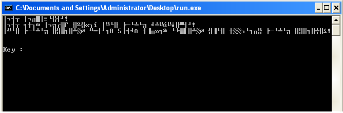
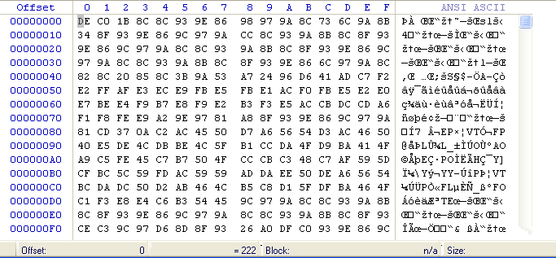
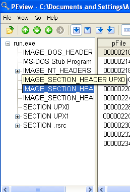
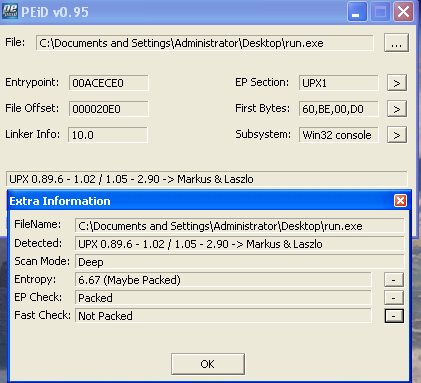
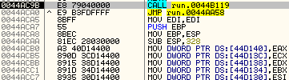
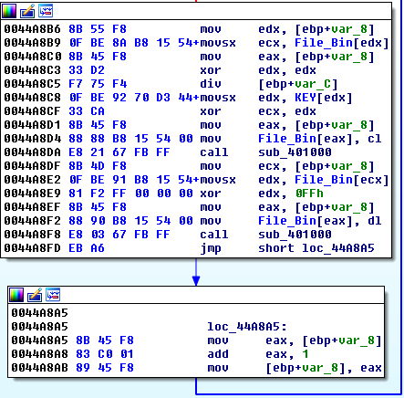
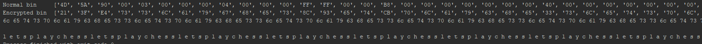

# Ransomware

source: http://reversing.kr/challenge.php

## Challenge
we have an exe file that wait for us to input a key, text file that tells us to `Decrypt File (EXE)` and file seems like the file we need to decrypt.



the encripted file's content



`Note: after the key will xor the binary content byte by byte single byte will xor all the bynaries with that byte, 2 bytes key will xor with jumps of 2 first byte the i+2 bytes and the second byte the i+1 bytes for 0<i<bytes amount, and so on`

## Solution

PEview show saction names UPX1, PEiD tells the same and  deep scan shows that the exe was packed with `UPX 0.89.6`

 

I unpacked that UPX manually.Finding the OEP with olly,after `PUSHAD` in `0xECECE0` Memory Brakepoint on access word on the esp value,
the program will brake few lines before the jump to OEP.



Dumping in `0x44AC9B` the imports was reconstructed with `RECconstractor` whic point us that the import in `RVA 4BFFC`.
After going to DUMP in ollyDbg to `RVA 4BFFC`-->`0x44BFFC` the imports seems to start at `0x44c000` to `0x44C0CC` -->`import size=0xCC`, imports fixed and the exe works fine

IDA shows that the main function has alot of junck instruction 

```asm
push eax
pop eax
push ebx
pop ebx
pusha
popa
nop
```

And after the junk which IDA commented at `Sorry,this node i too big to display`, the real code shows up.
The `sub_401000` seems to be junk code then jumping over in olly nothing happened we so its no seems important.

The main code tries to open file and read his binarys indeed the files name is `file` our encyripted file after few checks if the open was success full and the bytes' read save we the rutin the invole xor.

`byte_44D370` defined at `0x44A798` so renamed to `KEY`

`byte_5415B8` defined at `0x44A87C` so renamed to `File_Bin`



after the loop is dont we have `fputc` instruction that returns the bin content to the `file` and the content is being printed 

from `0x44A8CF` and `0x44A8E9` we know that the for evety byte in bin `new_byte=(old_byte) xor byte_key xor 0xFF`
Every PE file start the same so if I xor te original file with normal file bin I should get the key (xored `0xFF` file's bin befor) that xored all this file from the begining.



the script

```python
import numpy as np
import matplotlib.pyplot as plt

with open("normalBin') as f:
     buff = f.read()
buff = ['{:02X}'.format(b) for b in buff]

with open("encryptedBin",'rb') as f:
     buff1 = f.read()
buff1 = ['{:02X}'.format(b) for b in buff1]
print("Normal bin    ",buff[0:100])
print("Encrypted bin ",buff1[0:100])
for i in range(200):
        a=int(buff[i], 16)
        b=int(buff1[i], 16)
        print(str(hex(a^b))[2:4],end=" ")

print("\n")
for i in range(200):
    a = int(buff[i],16)
    b = int(buff1[i],16)
    aa=int(str(a),10)
    bb = int(str(b), 10)
    print(chr(int((aa^bb))),end=" ")

```
