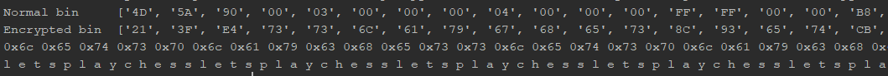

# Ransomware

source: http://reversing.kr/challenge.php

## Challenge
we have an exe file that waits for us to input a key, text file that tells us to `Decrypt File (EXE)` and the file seems like the file we need to decrypt.


the encrypted file's content


`Note: after the key will xor the binary content byte by byte single byte will xor all the binaries with that byte, 2 bytes key will xor with jumps of 2 first byte the i bytes and the second byte the i+1 bytes for 0<i<bytes amount, and so on`

## Solution

PEview show section names UPX1, PEiD tells the same and  deep scan shows that the exe was packed with `UPX 0.89.6`

 

I unpacked that UPX manually. Finding the OEP with olly, after `PUSHAD` in `0xECECE0` Memory Breakpoint on access word on the esp value,
the program will brake few lines before the jump to OEP.


Dumping in `0x44AC9B` the imports was reconstructed with `RECconstractor` which points us that the import in `RVA 4BFFC`.
After going to DUMP in ollyDbg to `RVA 4BFFC`-->`0x44BFFC` the imports seems to start at `0x44c000` to `0x44C0CC` -->`import size=0xCC`, imports fixed and the exe works fine

IDA shows that the main function has a lot of junk instruction 

```asm
push eax
pop eax
push ebx
pop ebx
pusha
popa
nop
```

And after the junk which IDA commented at `Sorry, this node I too big to display`, the real code shows up.
The `sub_401000` seems to be junk code then jumping over in olly nothing happened we so it's no seems important.

The main code tries to open the file and reads his binaries indeed the file's name is `file` our encrypted file after few checks if the open was successful full and the bytes' read save we the rutin the involve xor.

`byte_44D370` defined at `0x44A798` so renamed to __KEY__

`byte_5415B8` defined at `0x44A87C` so renamed to __File_Bin__


after the loop is don't we have `fputc` instruction that returns the bin content to the `file` and the content is being printed 

from `0x44A8CF` and `0x44A8E9` we know that the for every byte in bin __(new_byte)=(old_byte) xor (byte_key) xor (0xFF)__
Every PE file start the same so if I xor the original file with normal file bin I should get the key 

I xored `0xFF` file's bin before so __(new_byte)xor (0xFF)=(old_byte) xor (byte_key)__ we will put __(new_byte)xor (0xFF)__ as __new_byte__ ---> __(new_byte)=(old_byte) xor (byte_key)__ 

__(new_byte)xor (old_byte)=(byte_key)__ 





```python
Normal bin ['4D','5A','90','00','03','00','00','00','04','00','00','00','FF','FF','00','00','B8','00','00','00','00','00','00', '00', '40', '00', '00', '00', '00', '00', '00', '00', '00', '00', '00', '00', '00', '00', '00', '00', '00', '00', '00', '00', '00', '00', '00', '00', '00', '00']
Encrypted bin ['21', '3F', 'E4', '73', '73', '6C', '61', '79', '67', '68', '65', '73', '8C', '93', '65', '74', 'CB', '70', '6C', '61', '79', '63', '68', '65', '33', '73', '6C', '65', '74', '73', '70', '6C', '61', '79', '63', '68', '65', '73', '73', '6C', '65', '74', '73', '70', '6C', '61', '79', '63', '68', '65']
6c 65 74 73 70 6c 61 79 63 68 65 73 73 6c 65 74 73 70 6c 61 79 63 68 65 73 73 6c 65 74 73 70 6c 61 79 63 68 65 73 73 6c 65 74 73 70 6c 61 79 63 68 65 
l e t s p l a y c h e s s l e t s p l a y c h e s s l e t s p l a y c h e s s l e t s p l a y c h e 
```


the script

```python
import NumPy as np
import matplotlib.pyplot as plt

with open("normalBin') as f:
     buff = f.read()
buff = ['{:02X}'.format(b) for b in buff]

with open("encryptedBin",'rb') as f:
     buff1 = f.read()
buff1 = ['{:02X}'.format(b) for b in buff1]
print("Normal bin    ",buff[0:50])
print("Encrypted bin ",buff1[0:50])
for i in range(50):
        a=int(buff[i], 16)
        b=int(buff1[i], 16)
        print(str(hex(a^b)),end=" ")

print("")
for i in range(100):
    a = int(str(int(buff[i],16)),10)
    b = int(str(int(buff1[i],16)),10)
    print(chr(int((a^b))),end=" ")

```

The key is __letsplaychess__, after running the `run.exe` we rename `file` to `file.exe` and run it


The solution is __Colle System__
