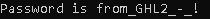

# x64 Lotto

source: http://reversing.kr/challenge.php

## Challenge
we have an exe file that asks for some input 

After inputting 6 different numbers the program restarts, if the input is not a number the programming glitch.

## Solution

I opened the program in IDA the main function saves the 6 numbers as we told, and run check routine.\
If everything is correct the main routine keeps forward to `0x014000114B` if not we go back to the numbers input.

Because there is no use in the input numbers later (after the check routine)\
I will jump from `0x140001128` to `0x14000114B` by this jump I will skip the check routine.\
In __x64__ the jump is by offsets. If the `EIP` is `1000` for example to jump to `1010` I will need to `JMP 0x0E` there is __0x2__ added to avoid infinite jump to current EIP.

I need to jump from `0x140001128` to `0x14000114B` its __0x23__ bytes so the instruction is `JMP 0x21` \
or in hex, `EB 21`
I order to edit this instruction in a hex editor we need to know the __Raw data offeset__.\
IDA tells us in the top of the main function `Offset to raw data for the section: 00000400`, and the instruction is in RVA `0x140001128` or offset `0x128`.\
So the instruction's location is `0x400+0x128=0x528`

__Before:__\
\
__After :__\

After saving the edited hex not matter what 6 numbers I put in the solution will be shown

The key is `from_GHL2_-_!`
